# SISOP-4-2026-IT-067
---

## SOAL 1 - Save Asisten KENZ
### Deskripsi 

Pada praktikum ini, dibuat sebuah filesystem virtual menggunakan FUSE (Filesystem in Userspace) dengan bahasa C bernama `kenz_rescue.c`. Program ini bertujuan untuk melakukan proses investigasi terhadap file-file fragmen yang diberikan pada folder `amba_files`.

Isi dari folder `amba_files` adalah file teks dari 1-7(1.txt, 2.txt,...), pada setiap file terdapat potongan koordinat.

Program yang diminta soal adalah:
1. Membuat filesystem virtual menggunakan FUSE
2. Menampilkan seluruh file asli (1.txt sampai 7.txt) secara passthrough
3. Membuat file virtual bernama: `tujuan.txt` secara on-the-fly (tanpa benar-benar membuat file fisik di disk)
4. Menggabungkan seluruh fragmen koordinat dari file 1.txt sampai 7.txt
5. Menampilkan hasil gabungan dengan format:"Tujuan Mas Amba: (koordinat gabungan)"

### Penjelasan

A. Membuat Filesystem FUSE

Pada poin pertama, program diminta untuk membuat filesystem virtual menggunakan FUSE (Filesystem in Userspace) dengan bahasa C melalui file kenz_rescue.c. Filesystem ini nantinya akan di-mount ke sebuah folder mount point sehingga dapat diakses seperti filesystem Linux biasa.

Implementasi filesystem dilakukan menggunakan library FUSE:
```c
#define FUSE_USE_VERSION 31
#include <fuse3/fuse.h>
```
`FUSE_USE_VERSION 31` digunakan untuk menentukan bahwa program menggunakan API FUSE versi 3. Sedangkan `fuse.h` merupakan library utama FUSE yang menyediakan callback filesystem seperti getattr, readdir, open, dan read.

Program menggunakan struktur operasi FUSE berikut:
```c
static const struct fuse_operations kenz_oper =
{
    .getattr = kenz_getattr,
    .readdir = kenz_readdir,
    .open = kenz_open,
    .read = kenz_read,
};
```
Struktur tersebut digunakan untuk menghubungkan operasi filesystem Linux dengan function yang dibuat pada program. Ketika Linux melakukan operasi file seperti membaca directory, membuka file, atau membaca isi file, maka FUSE akan memanggil function yang sesuai.

Filesystem dijalankan melalui function main():
```c
int main(int argc, char *argv[])
{
    umask(0);
    return fuse_main(argc, argv, &kenz_oper, NULL);
}
```
`fuse_main()` digunakan untuk menjalankan filesystem FUSE dan melakukan mount filesystem ke mount point yang diberikan user.

Cara menjalankan filesystem: `./kenz_rescue -f mnt`

Ketika program dijalankan, folder mnt akan berubah menjadi filesystem virtual yang seluruh operasinya dikontrol oleh callback pada `kenz_rescue.c`

B. Menampilkan File Fragment

Pada poin kedua, filesystem diminta untuk menampilkan seluruh file fragment yang berada pada folder amba_files, yaitu: 1.txt, 2.txt....

Implementasi dilakukan pada function `kenz_readdir()` yang bertugas membaca isi directory.
```c
static int kenz_readdir(
    const char *path,
    void *buf,
    fuse_fill_dir_t filler,
    off_t offset,
    struct fuse_file_info *fi,
    enum fuse_readdir_flags flags)
```
Function ini dipanggil ketika user menjalankan perintah: `ls`

Langkah pertama yang dilakukan program adalah mengubah path virtual FUSE menjadi path asli pada folder amba_files menggunakan function `build_path()`:
```c
build_path(fpath, path);
```
Kemudian directory asli dibuka menggunakan:
```c
dp = opendir(fpath);
```
Setelah directory berhasil dibuka, program membaca seluruh isi folder menggunakan loop:
```c
while ((de = readdir(dp)) != NULL)
```
Setiap file yang ditemukan kemudian dikirim ke Linux menggunakan:
```c
filler(buf, de->d_name, NULL, 0, 0);
```
Function `filler()` digunakan untuk memberitahu Linux bahwa file tersebut ada pada filesystem virtual.

Akibatnya, ketika user menjalankan `ls mnt`
maka seluruh file fragment dari folder amba_files akan muncul pada mount point FUSE.

C. Membuat File Virtual tujuan.txt

Pada poin ketiga, program diminta untuk membuat file virtual bernama `tujuan.txt` File ini tidak boleh benar-benar dibuat pada folder asli amba_files, melainkan hanya muncul ketika filesystem FUSE di-mount.

Implementasi pertama dilakukan pada `kenz_readdir()`:
```c
filler(buf, "tujuan.txt", NULL, 0, 0);
```
Baris tersebut digunakan untuk menambahkan file virtual tujuan.txt ke hasil pembacaan directory walaupun file aslinya tidak ada di disk.

Agar file virtual dapat dikenali Linux, metadata file juga dibuat secara manual pada `kenz_getattr()`:
```c
if (strcmp(path, "/tujuan.txt") == 0)
{
    stbuf->st_mode = S_IFREG | 0444;
    stbuf->st_nlink = 1;
}
```
`S_IFREG` menandakan bahwa file tersebut adalah regular file, sedangkan 0444 memberikan permission read-only.

Karena file tidak benar-benar ada di disk, ukuran file juga harus dihitung manual. Program membaca seluruh fragment koordinat, menggabungkannya, kemudian menghitung ukuran string hasil akhir menggunakan:
```c
stbuf->st_size = strlen(combined);
```
Selain metadata, proses membuka file virtual juga ditangani khusus pada `kenz_open()`:
```c
if (strcmp(path, "/tujuan.txt") == 0)
{
    return 0;
}
```
Karena file virtual tidak ada secara fisik, program cukup mengizinkan akses tanpa membuka file asli.

Hasilnya, file `tujuan.txt` dapat muncul dan dibaca seperti file Linux biasa walaupun sebenarnya hanya dibuat secara virtual oleh FUSE.

D. Menemukan Koordinat Ritual

Pada poin terakhir, program diminta untuk membaca seluruh file fragment dan mengambil bagian koordinat setelah teks: "KOORD:"
Seluruh fragment koordinat tersebut kemudian digabung menjadi satu string dan ditampilkan pada file virtual `tujuan.txt`

Implementasi utama dilakukan pada function `kenz_read()`

Ketika user menjalankan: `cat mnt/tujuan.txt`
maka FUSE akan memanggil `kenz_read()` untuk menghasilkan isi file virtual secara dinamis.

Pertama, program membuat buffer untuk menyimpan hasil gabungan:
```c
char *combined = malloc(20000);
```
Kemudian program menambahkan prefix sesuai soal:
```c
strcpy(combined, "Tujuan Mas Amba: ");
```
Program lalu melakukan loop membaca file 1.txt sampai 7.txt:
```c
for (int i = 1; i <= 7; i++)
```
Setiap file dibuka menggunakan:
```c
FILE *fp = fopen(temp_path, "r");
```
Isi file dibaca per baris menggunakan:
```c
while (fgets(temp, sizeof(temp), fp) != NULL)
```
Program kemudian mencari substring "KOORD:" menggunakan:
```c
char *ptr = strstr(temp, "KOORD:");
```
Jika substring ditemukan, pointer digeser setelah teks "KOORD:":
```c
ptr += strlen("KOORD:");
```
Selanjutnya newline dihapus menggunakan:
```c
ptr[strcspn(ptr, "\n")] = '\0';
```
dan spasi di depan dihapus menggunakan:
```c
while (*ptr == ' ')
{
    ptr++;
}
```
Fragment koordinat kemudian digabung menggunakan:
```c
strcat(combined, ptr);
```
Setelah seluruh file selesai diproses, program menambahkan newline di akhir file:
```c
strcat(combined, "\n");
```
Isi file virtual kemudian dikirim ke Linux menggunakan:
```c
memcpy(buf, combined + offset, size);
```
Hasil akhirnya adalah file virtual tujuan.txt yang berisi:
```
Tujuan Mas Amba: -7.957382728443728, 112.4698688227961, 23:59 WIB
```
Semua proses dilakukan secara on-the-fly tanpa membuat file fisik baru pada folder asli.

### Dokumentasi

Terminal akan berhenti jika program fuse berhasil dijalankan

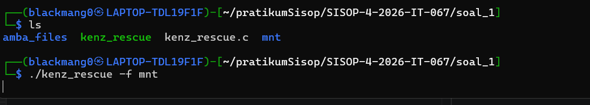

Program berhasil menampilkan isi folder amba_files melalui folder mnt yang telah termount

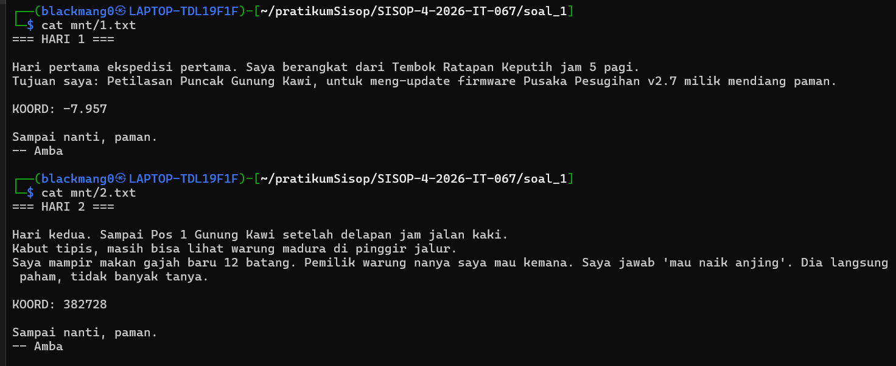

Terdapat file virtual `tujuan.txt` didalam folder mnt namun tidak ada di amba_files

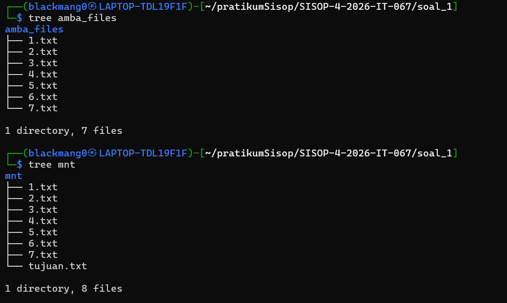

Isi dari file `tujuan.txt` adalah gabungan koordinat

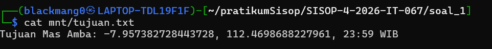

### Kendala

Tidak ada

## SOAL 2 - Poke MOO

### Deskripsi

Pada praktikum ini dibuat sebuah filesystem virtual menggunakan FUSE (Filesystem in Userspace) dengan bahasa C. Filesystem ini berfungsi sebagai perantara antara direktori asli `encrypted_storage` dan direktori mount point `fuse_mount`.

Filesystem yang dibuat harus dapat menjalankan operasi dasar filesystem seperti:

1. membaca isi direktori
2. membuat file dan folder
3. membuka file
4. membaca isi file
5. menulis file
6. menghapus file
7. melihat metadata file

Selain itu, filesystem juga menerapkan sistem enkripsi sederhana menggunakan XOR. File yang disimpan pada direktori asli `encrypted_storage` akan memiliki ekstensi .enc dan isi file tersimpan dalam keadaan terenkripsi. Namun ketika file diakses melalui `fuse_mount`, file akan otomatis didekripsi sehingga terlihat normal oleh user.

Praktikum ini juga menggunakan program server dan client yang dijalankan menggunakan Docker. Program client digunakan untuk memberikan perintah database sederhana seperti:

- CREATE DATABASE
- CREATE TABLE
- INSERT
- SELECT
- DELETE
- UPDATE

Sedangkan server bertugas menyimpan data ke filesystem.

Struktur direktori program:

1. fuse.c → implementasi filesystem FUSE
2. client.c → program client database
3. server → binary server database
4. Dockerfile → konfigurasi container Docker
5. encrypted_storage → direktori penyimpanan asli
6. fuse_mount → mount point filesystem virtual

### Penjelasan

Pada praktikum ini dibuat sebuah filesystem virtual menggunakan FUSE (Filesystem in Userspace) dengan bahasa C. Filesystem ini berfungsi sebagai penghubung antara direktori asli encrypted_storage dan mount point fuse_mount. Semua operasi file yang dilakukan user pada fuse_mount akan diteruskan ke encrypted_storage, sehingga mount point terlihat seperti filesystem Linux biasa.

Program dimulai dengan menentukan versi FUSE dan mengimpor library yang diperlukan:
```c
#define FUSE_USE_VERSION 31

#include <fuse3/fuse.h>
#include <stdio.h>
#include <string.h>
#include <errno.h>
#include <fcntl.h>
#include <dirent.h>
#include <unistd.h>
#include <stdlib.h>
#include <sys/stat.h>
#include <limits.h>
```
Library tersebut digunakan untuk operasi filesystem seperti membaca file, membuat file, membaca direktori, dan mengakses metadata file.

Direktori asli filesystem disimpan pada variabel:
```c
static const char *real_root =
"/home/blackmang0/pratikumSisop/SISOP-4-2026-IT-067/soal_2/encrypted_storage";
```
Seluruh file asli akan disimpan pada direktori ini.
Sesuai ketentuan soal, file harus terenkripsi menggunakan XOR. Untuk itu dibuat function:
```c
void xor_buffer(char *buf, size_t size)
{
    for (size_t i = 0; i < size; i++)
        buf[i] ^= 0x76;
}
```
Function ini melakukan XOR terhadap setiap karakter buffer menggunakan key `0x76`. XOR dipakai karena proses enkripsi dan dekripsinya menggunakan operasi yang sama.

Program kemudian membuat function `build_path()`:
```c
static void build_path(char fpath[PATH_MAX], const char *path)
{
    char normal[PATH_MAX];

    snprintf(normal, PATH_MAX,
             "%s%s", real_root, path);

    if (access(normal, F_OK) == 0) {
        strcpy(fpath, normal);
        return;
    }

    snprintf(fpath, PATH_MAX,
             "%s%s.enc", real_root, path);
}
```
Function ini digunakan untuk menerjemahkan path virtual pada fuse_mount menjadi path asli pada `encrypted_storage`.

Contoh `fuse_mount/test.txt`
akan diarahkan menjadi `encrypted_storage/test.txt.enc`

Ketentuan pertama pada soal adalah implementasi operasi filesystem seperti getattr, readdir, mkdir, create, read, write, dan lainnya.

Operasi getattr digunakan untuk mengambil metadata file:
```c
static int xmp_getattr(const char *path,
                       struct stat *stbuf,
                       struct fuse_file_info *fi)
{
    char fpath[PATH_MAX];

    build_path(fpath, path);

    int res = lstat(fpath, stbuf);

    if (res == -1)
        return -errno;

    return 0;
}
```
Function ini memanggil `lstat()` pada file asli untuk mendapatkan ukuran file, permission, dan tipe file.

Untuk membaca isi direktori digunakan `readdir`:
```c
static int xmp_readdir(...)
{
    ...

    while ((de = readdir(dp)) != NULL) {

        char name[NAME_MAX];
        strcpy(name, de->d_name);

        if (strstr(name, ".enc")) {
            name[strlen(name) - 4] = '\0';
        }

        filler(buf, name, &st, 0, 0);
    }

    ...
}
```
Pada function ini ekstensi .enc disembunyikan agar file terenkripsi tetap terlihat normal pada mount point.

Contohnya 
`encrypted_storage/data.txt.enc` akan terlihat sebagai `data.txt`

Untuk membuat folder digunakan mkdir:
```c
static int xmp_mkdir(const char *path,
                     mode_t mode)
{
    char fpath[PATH_MAX];

    build_path(fpath, path);

    int res = mkdir(fpath, mode);

    if (res == -1)
        return -errno;

    return 0;
}
```
Saat user membuat folder di `fuse_mount`, folder asli juga otomatis dibuat di `encrypted_storage`.

Pembuatan file dilakukan menggunakan create:
```c
static int xmp_create(const char *path,
                      mode_t mode,
                      struct fuse_file_info *fi)
{
    char fpath[PATH_MAX];

    snprintf(fpath, PATH_MAX,
             "%s%s.enc",
             real_root,
             path);

    int fd = open(fpath,
                  fi->flags,
                  mode);

    fi->fh = fd;

    return 0;
}
```
Sesuai soal, setiap file yang dibuat otomatis ditambahkan ekstensi .enc.

Contohnya `echo "halo" > fuse_mount/file.txt`akan menghasilkan
`encrypted_storage/file.txt.enc`

Untuk membuka file digunakan open:
```c
static int xmp_open(const char *path,
                    struct fuse_file_info *fi)
{
    char fpath[PATH_MAX];

    build_path(fpath, path);

    int fd = open(fpath, fi->flags);

    fi->fh = fd;

    return 0;
}
```
File descriptor disimpan pada `fi->fh` agar dapat digunakan saat read dan write.

Operasi read digunakan untuk membaca file:
```c
static int xmp_read(const char *path,
                    char *buf,
                    size_t size,
                    off_t offset,
                    struct fuse_file_info *fi)
{
    int res = pread(fi->fh,
                    buf,
                    size,
                    offset);

    char fpath[PATH_MAX];
    build_path(fpath, path);

    if (strstr(fpath, ".enc"))
        xor_buffer(buf, res);

    return res;
}
```
File dibaca menggunakan `pread()`, kemudian didekripsi menggunakan XOR sebelum ditampilkan ke user.

Operasi write digunakan untuk menulis file:
```c
static int xmp_write(const char *path,
                     const char *buf,
                     size_t size,
                     off_t offset,
                     struct fuse_file_info *fi)
{
    char *tmp = malloc(size);

    memcpy(tmp, buf, size);

    xor_buffer(tmp, size);

    int res = pwrite(fi->fh,
                     tmp,
                     size,
                     offset);

    free(tmp);

    return res;
}
```
Sebelum data ditulis ke storage, buffer terlebih dahulu dienkripsi menggunakan XOR sehingga isi file pada encrypted_storage tetap terenkripsi.

Program juga mengimplementasikan:

- `truncate` untuk mengubah ukuran file
- `unlink` untuk menghapus file
- `access` untuk mengecek permission file
- `utimens` untuk mengubah metadata waktu file

Seluruh operasi tersebut didaftarkan pada:
```c
static const struct fuse_operations xmp_oper = {
    .getattr = xmp_getattr,
    .readdir = xmp_readdir,
    .mkdir = xmp_mkdir,
    .create = xmp_create,
    .open = xmp_open,
    .read = xmp_read,
    .write = xmp_write,
    .truncate = xmp_truncate,
    .unlink = xmp_unlink,
    .access = xmp_access,
    .utimens = xmp_utimens,
};
```
Kemudian filesystem dijalankan menggunakan:
```c
int main(int argc, char *argv[])
{
    umask(0);

    return fuse_main(argc,
                     argv,
                     &xmp_oper,
                     NULL);
}
```
Saat program dijalankan`./fuse -f fuse_mount`

maka fuse_mount akan menjadi filesystem virtual.

Selain FUSE, soal juga meminta integrasi Docker dan client-server database sederhana. Container dijalankan menggunakan:
```bash
sudo docker run -d \
-p 9000:9000 \
-v $(pwd)/encrypted_storage:/app/db \
--name db_app \
soal2-modul4-sisop
```
Bind mount tersebut membuat data database tersimpan langsung pada `encrypted_storage`

Program client.c digunakan untuk mengirim command database ke server melalui socket TCP seperti:
```sql
CREATE DATABASE
CREATE TABLE
INSERT
SELECT
UPDATE
DELETE
```
Server kemudian membuat folder database dan file CSV pada filesystem

Pada bagian containerization, soal meminta server database dijalankan menggunakan Docker agar aplikasi berjalan di dalam container terisolasi. Untuk itu dibuat file `Dockerfile` yang berisi konfigurasi image Docker.

Isi `Dockerfile`:
```Dockerfile
FROM ubuntu:latest

WORKDIR /app

COPY . /app

EXPOSE 9000

CMD ["./server"]
```
Baris `FROM ubuntu:latest` digunakan untuk menentukan base image yang dipakai yaitu Ubuntu terbaru.

Kemudian `WORKDIR /app`
digunakan untuk menentukan direktori kerja utama di dalam container. Semua file program akan dijalankan dari direktori `/app`

Selanjutnya `COPY . /app`

digunakan untuk menyalin seluruh file project seperti:
`server`
`client`
`fuse.c`
`encrypted_storage`ke dalam container Docker.

Bagian `EXPOSE 9000`digunakan untuk membuka port 9000 agar server dapat menerima koneksi TCP dari client.

Terakhir `CMD ["./server"]` digunakan agar program server otomatis dijalankan saat container aktif.

Setelah Dockerfile selesai dibuat, image dibangun menggunakan:
```bash
sudo docker build -t soal2-modul4-sisop .
```
Perintah tersebut membuat image Docker dengan nama `soal2-modul4-sisop`.

Pada bagian integration, soal meminta container dijalankan dengan bind mount agar filesystem FUSE terhubung dengan database di dalam container.

Container dijalankan menggunakan:
```bash
sudo docker run -d \
-p 9000:9000 \
-v $(pwd)/encrypted_storage:/app/db \
--name db_app \
soal2-modul4-sisop
```
Bagian `-p 9000:9000` digunakan untuk menghubungkan port container dengan port host sehingga client dapat terhubung ke server melalui TCP socket pada port 9000.

Bagian `-v $(pwd)/encrypted_storage:/app/db`
yang merupakan bind mount Docker. Direktori `encrypted_storage` pada host dihubungkan ke direktori `/app/db` di dalam container. Dengan demikian seluruh database yang dibuat server akan langsung tersimpan ke filesystem host.

Awalnya bind mount dicoba langsung ke fuse_mount, namun pada environment Kali Linux berbasis WSL terjadi error permission dan mount conflict karena Docker tidak dapat melakukan bind mount langsung ke filesystem FUSE. Oleh karena itu integrasi dilakukan langsung ke encrypted_storage sebagai backing storage filesystem.

Setelah container berjalan, program client.c digunakan untuk berinteraksi dengan server melalui TCP socket:
```bash
./client
```
Client kemudian dapat mengirim command seperti:
```sql
CREATE DATABASE mahasiswa
CREATE TABLE mahasiswa biodata nama email
INSERT mahasiswa biodata kevin kevinu@gmail.com
```
Server menerima command tersebut dan otomatis membuat folder database serta file CSV pada storage.

Contohnya `encrypted_storage/mahasiswa/biodata.csv`

Karena filesystem FUSE terhubung ke `encrypted_storage`, maka file yang dibuat server juga dapat diakses melalui mount point `fuse_mount/mahasiswa/biodata.csv`

### Dokumentasi

Program FUSE berjalan

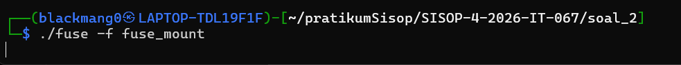

Buat file baru dan tampilan isi dari direktori `encrypted_storage` dan `fuse_mount`

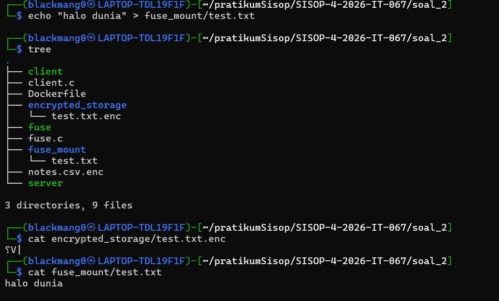

Buat folder di fuse 

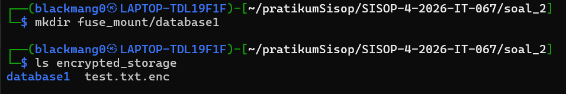

Hapus file dan folder 

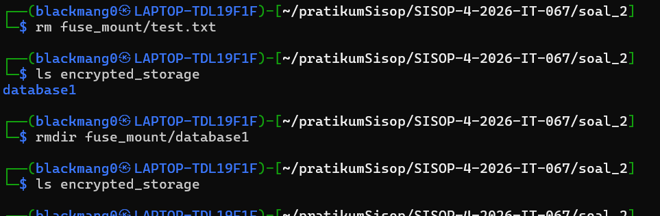

Meng run docker

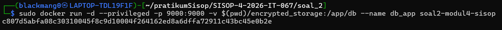

tampilan jalankan client

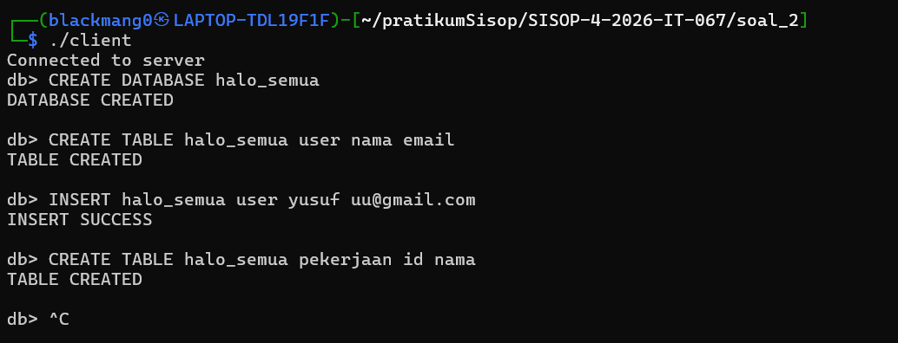
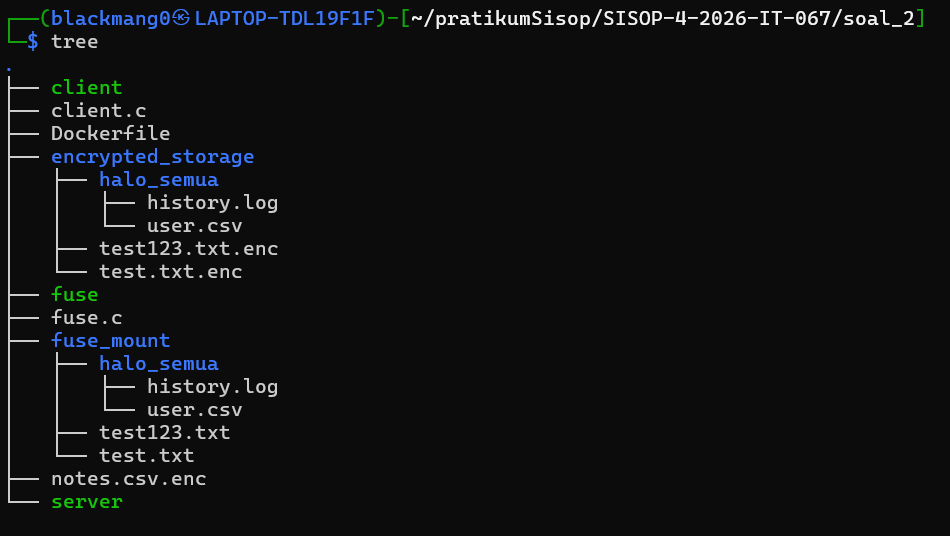

### Kendala

Kendala utama selama pengerjaan praktikum adalah banyaknya error saat compile FUSE. Error yang muncul seperti:

- `PATH_MAX undeclared`
- `errno undeclared`
- `struct fuse_operations incomplete type`

Masalah ini disebabkan karena beberapa header library belum ditambahkan dan beberapa function FUSE belum sesuai dengan format FUSE3. Solusinya adalah menambahkan library yang diperlukan seperti:
```c
#include <errno.h>
#include <limits.h>
#include <fcntl.h>
#include <unistd.h>
```
Kendala berikutnya adalah filesystem FUSE tidak dapat dimount karena muncul error permission denied. Masalah ini disebabkan oleh penggunaan relative path dan mount point yang belum benar. Solusinya adalah menggunakan absolute path dan memastikan direktori mount point sudah tersedia.

Kendala terbesar terjadi saat integrasi Docker dengan FUSE. Docker tidak dapat melakukan bind mount langsung ke fuse_mount dan menghasilkan error `mkdir ... file exists`

Hal ini terjadi karena Docker pada environment WSL/Kali tidak mendukung bind mount langsung ke filesystem FUSE. Solusinya adalah menggunakan encrypted_storage sebagai bind mount Docker.

Kendala lain adalah file database yang dibuat server tidak otomatis memiliki ekstensi .enc. Hal ini terjadi karena server binary menulis langsung ke backing storage tanpa melewati syscall FUSE. Untuk mengatasi hal tersebut dilakukan modifikasi pada function `build_path()`, `readdir()`, dan `read()` agar filesystem dapat membaca file .enc maupun file biasa.

Selain itu sempat terjadi masalah dimana isi file pada mount point tampil sebagai karakter acak. Penyebabnya adalah proses XOR dijalankan pada semua file termasuk file normal. Solusinya adalah proses XOR hanya dilakukan pada file yang memiliki ekstensi .enc

## SOAL 3 - LibraryIT

### Deskripsi

Pada praktikum ini dilakukan pembuatan sistem file sharing menggunakan Samba Server yang dijalankan di dalam container Docker. Sistem dirancang agar beberapa user memiliki hak akses yang berbeda terhadap folder tertentu sesuai ketentuan soal. Selain itu, sistem juga dilengkapi dengan fitur logging untuk mencatat aktivitas user seperti koneksi ke folder dan penulisan file.

Dalam pengerjaan praktikum ini digunakan Docker agar sistem dapat berjalan secara terisolasi dan mudah dijalankan pada perangkat lain. Seluruh konfigurasi utama berada pada beberapa file penting, yaitu:

- Dockerfile
- docker-compose.yml
- smb.conf
- entrypoint.sh

Folder sharing yang dibuat terdiri dari:
* ebooks
* papers
* sourcecode
* docs

Setiap folder memiliki aturan akses yang berbeda. User tertentu hanya dapat membaca file, sedangkan user lainnya dapat melakukan penulisan file. Sistem juga mencatat aktivitas user ke dalam file log bernama `libraryit.log`

### Penjelasan
1. `Dockerfile`

File Dockerfile digunakan untuk membuat image Docker yang berisi Samba Server beserta dependency yang diperlukan.

Bagian `FROM ubuntu:22.04`

digunakan untuk menentukan base image yang dipakai, yaitu Ubuntu 22.04.

Selanjutnya dilakukan instalasi package:
```
RUN apt update && apt install -y \
    samba \
    samba-common-bin \
    acl
```
Package samba digunakan untuk membuat Samba Server, samba-common-bin digunakan untuk command tambahan Samba seperti smbpasswd, sedangkan acl digunakan untuk mengatur Access Control List pada folder sharing.

Kemudian dilakukan penyalinan file konfigurasi:
```
COPY smb.conf /etc/samba/smb.conf
COPY entrypoint.sh /entrypoint.sh
```
File smb.conf menjadi konfigurasi utama Samba, sedangkan entrypoint.sh akan dijalankan saat container aktif.

Permission executable diberikan menggunakan:
```
RUN chmod +x /entrypoint.sh
```
Port Samba dibuka menggunakan:
```
EXPOSE 139 445
```
Port 139 dan 445 merupakan port default SMB/Samba.

Container kemudian dijalankan menggunakan:
```
ENTRYPOINT ["/entrypoint.sh"]
```

2. `docker-compose.yml`

File `docker-compose.yml` digunakan untuk menjalankan seluruh container.

Container utama terdiri dari:
```yml
libraryit-server
libraryit-logger
```
libraryit-server digunakan untuk menjalankan Samba Server, sedangkan libraryit-logger digunakan untuk menampilkan log secara realtime.

Pada bagian:
```yml
ports:
  - "1139:139"
  - "1445:445"
```
dilakukan mapping port dari host ke container.

Artinya
port 1139 pada host terhubung ke port 139 container
port 1445 pada host terhubung ke port 445 container

Volume Docker digunakan agar folder pada host dapat langsung digunakan oleh container:
```yml
volumes:
  - ./data:/libraryit
  - ./logs:/var/log/libraryit
```
Folder `./data` pada host akan menjadi `/libraryit` di container, sedangkan folder `./logs menjadi /var/log/libraryit`.

Dengan begitu file hasil upload dan log tetap tersimpan di host walaupun container dihentikan.

Container dijalankan menggunakan
`docker-compose up --build -d`

dan dapat dicek menggunakan`docker ps`

3. `smb.conf`

File `smb.conf` merupakan konfigurasi utama Samba Server.

Pada bagian global:
```conf
[global]
   workgroup = WORKGROUP
   security = user
```
workgroup menentukan nama workgroup Samba, sedangkan security = user berarti autentikasi menggunakan username dan password.

Folder ebooks
```conf
[ebooks]
   path = /libraryit/ebooks
   writable = yes
   valid users = contributor
```
Folder ebooks hanya dapat diakses dan ditulis oleh user contributor.

User lain tidak memiliki izin untuk melakukan upload file.

Folder papers
```conf
[papers]
   path = /libraryit/papers
   writable = yes
   valid users = contributor
```
Folder papers juga hanya dapat ditulis oleh contributor.

Folder sourcecode
```conf
[sourcecode]
   path = /libraryit/sourcecode
   writable = no
   valid users = member
```
Folder sourcecode hanya dapat diakses oleh member dan bersifat readonly sehingga file tidak dapat diupload.

Saat dilakukan command `put test.txt`
akan muncul `NT_STATUS_ACCESS_DENIED`
Folder docs
```conf
[docs]
   path = /libraryit/docs
   writable = yes
   valid users = librarian contributor member
```
Folder docs dapat diakses semua user, tetapi permission Linux dan ACL membatasi write hanya untuk librarian.

Contributor dan member hanya memiliki akses baca.

4. `entrypoint.sh`

File `entrypoint.sh` merupakan script utama yang dijalankan saat container aktif. File ini mengatur seluruh konfigurasi sistem secara otomatis.

Pembuatan Group
```sh
groupadd readonly
groupadd staff
```
Program membuat dua group:
```sh
readonly
staff
```
Group readonly digunakan untuk user dengan akses baca saja, sedangkan staff digunakan untuk user dengan akses lebih tinggi.

Pembuatan User
```sh
useradd -M -s /sbin/nologin member
```
Program membuat user:
```sh
member
contributor
librarian
```
Option:

`-M` berarti tidak membuat home directory
`-s /sbin/nologin` berarti user tidak dapat login shell Linux

Pemberian Password Linux
```sh
echo "member:member123" | chpasswd
```
Digunakan untuk mengatur password Linux user.

Pemberian Password Samba
```sh
(echo "member123"; echo "member123") | smbpasswd -s -a member
```
Digunakan untuk menambahkan user ke database Samba agar dapat login melalui SMB.

Pembuatan Folder Sharing
```sh
mkdir -p /libraryit/ebooks
```
Digunakan untuk membuat folder sharing yang nantinya akan digunakan Samba.

Folder yang dibuat:
`ebooks`
`papers`
`sourcecode`
`docs`
Pengaturan Ownership dan Permission
```sh
chown -R root:staff /libraryit/ebooks
chmod -R 770 /libraryit/ebooks
```
chown digunakan untuk menentukan owner folder.

chmod digunakan untuk mengatur permission Linux.

Permission `770` berarti owner dan group memiliki akses penuh
`750` berarti hanya owner yang memiliki write
Penggunaan ACL

ACL digunakan agar permission dapat diatur lebih spesifik.

```sh
setfacl -m u:librarian:rwx /libraryit/docs
```
Command tersebut memberikan:
`read`
`write`
`execute`
kepada user librarian.

Sedangkan contributor dan member hanya diberikan permission read.

6. Sistem Logging

Program menggunakan logger manual berbasis bash script agar format log sesuai dengan ketentuan soal.

Logger berjalan menggunakan loop:
`while true
do`

Program terus memonitor folder sharing untuk mendeteksi perubahan file.

Pengecekan file dilakukan menggunakan:
```sh
find /libraryit/ebooks -type f
```
Saat ditemukan file baru hasil upload user, program akan menuliskan log ke `logs/libraryit.log`

Contoh log:
```
[2026-05-17 05:55:20] [INFO] [contributor] [WRITE] [ebooks]
```
Log tersebut menunjukkan bahwa user contributor melakukan upload file ke folder ebooks.

Program juga mencatat
`CONNECT`
`WRITE`
`DENIED`
sesuai aktivitas user.

Log realtime dapat dilihat menggunakan:
```
docker logs -f libraryit-logger
```

### Dokumentasi

Daftar member, group, dan isi folder `libraryit`

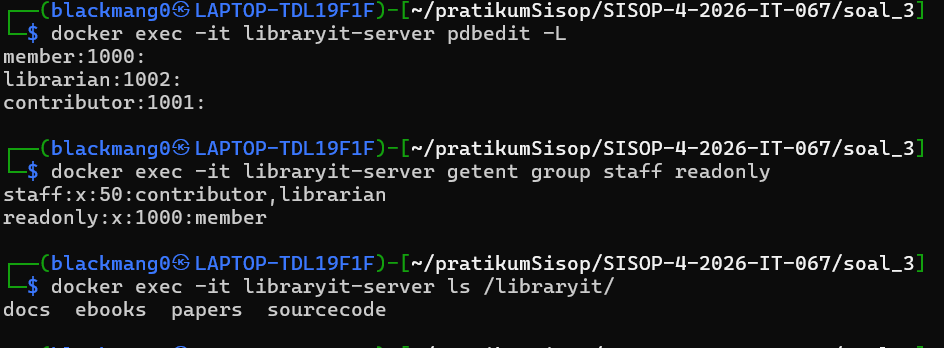

Contributor dapat menulis di ebooks dan papers, sedangkan member tidak bisa menulis di sourcecode

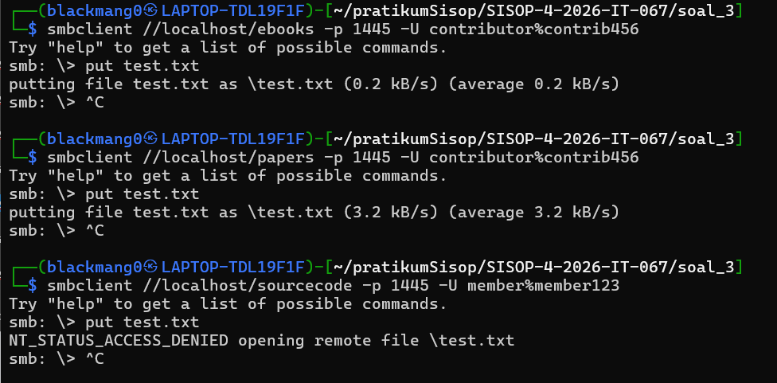

Contributor tidak dapat menulis di docs namun, librarian bisa menulis di docs padahal keduanya termasuk group staff

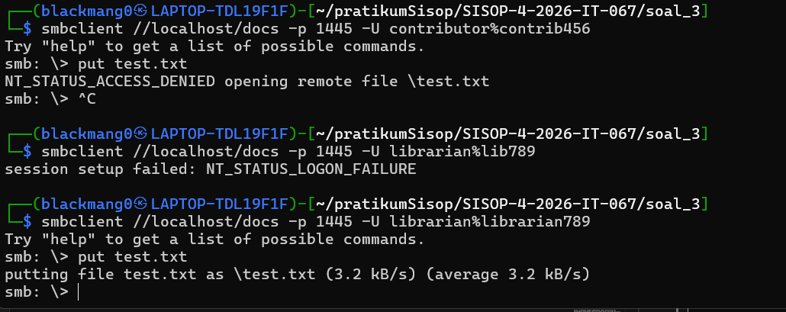

Pencatatan log di `logs/libraryit.log`

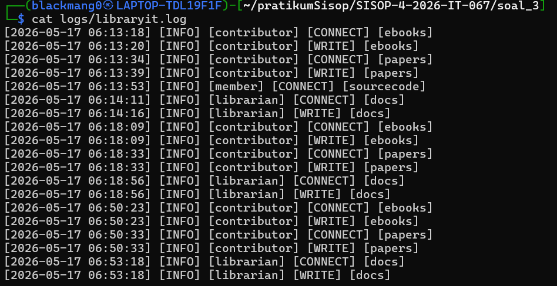


### Kendala
1. Permission Docker

Saat pertama menjalankan Docker muncul error:
```
permission denied while trying to connect to the Docker daemon socket
```
Masalah terjadi karena user belum memiliki akses ke Docker daemon

Solusi:
```bash
sudo usermod -aG docker $USER
```
2. Group readonly Tidak Ada

Awalnya group readonly belum dibuat sehingga muncul error:
```
group 'readonly' does not exist
```
Solusi dilakukan dengan menambahkan:
```bash
groupadd readonly
```
3. Log Samba Terlalu Panjang

Log bawaan Samba menghasilkan output yang sangat panjang dan tidak sesuai format soal.

Solusi dilakukan dengan membuat logger manual menggunakan bash script sehingga log hanya menampilkan informasi penting seperti
`CONNECT`
`WRITE`
`DENIED`

4. Log Tidak Muncul

Pada awal pengerjaan logger tidak mendeteksi upload file karena folder monitoring salah dan proses monitoring terus mengulang log `CONNECT`

Solusi dilakukan dengan memperbaiki path monitoring dan menambahkan pengecekan agar log tidak terus tercetak berulang.

